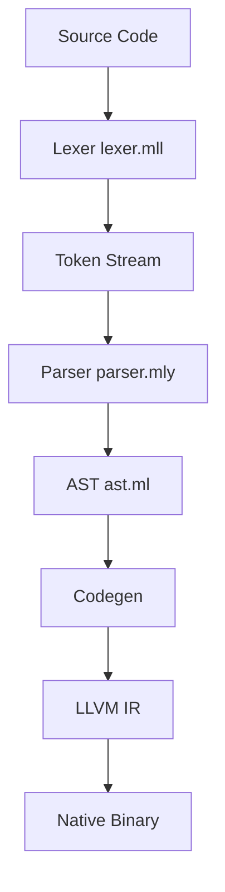

# Design Document: Ardium Compiler Analysis

## Overview

การวิเคราะห์ Parser, AST และ Lexer ของ Ardium compiler เป็นการศึกษาโครงสร้างและการทำงานของระบบคอมไพเลอร์ที่ใช้ OCaml, Menhir และ OCamllex ในการสร้าง compiler สำหรับภาษา Ardium ที่มีคุณสมบัติ modern programming language พร้อม declarative UI และ framework ecosystem

## Architecture

### Compilation Pipeline
```
Source Code (.ar) → Lexer → Tokens → Parser → AST → Codegen → LLVM IR → Native Binary
```

### Component Relationships


## Components and Interfaces

### 1. Lexer Component (lexer.mll)

**Purpose**: แปลงโค้ดต้นฉบับเป็น token stream

**Key Features**:
- **Token Types**: 35+ token types รวมถึง keywords, operators, literals
- **Keyword Recognition**: รองรับ keywords หลัก เช่น `fn`, `let`, `var`, `if`, `else`, `loop`, `class`, `struct`
- **Operator Support**: arithmetic (`+`, `-`, `*`, `/`), comparison (`==`, `!=`, `<`, `>`), logical
- **Literal Handling**: integers, floats, strings with escape sequences, hexadecimal numbers
- **Comment Processing**: single-line comments (`//`)
- **String Processing**: รองรับ escape sequences (`\n`, `\t`, `\\`, `\"`)

**Token Categories**:
1. **Keywords**: `FN`, `LET`, `VAR`, `IF`, `ELSE`, `LOOP`, `RETURN`, `CLASS`, `STRUCT`, `ENUM`
2. **Operators**: `PLUS`, `MINUS`, `TIMES`, `DIV`, `EQ_EQ`, `NOT_EQ`, `LESS`, `GREATER`
3. **Delimiters**: `LPAREN`, `RPAREN`, `LBRACE`, `RBRACE`, `SEMI`, `COMMA`
4. **Literals**: `INT`, `FLOAT`, `STRING`, `ID`
5. **Special**: `GLOBAL_KEY`, `ASYNC`, `AWAIT`, `AT`, `DOT`, `COLON`

### 2. Parser Component (parser.mly)

**Purpose**: แปลง token stream เป็น Abstract Syntax Tree

**Grammar Structure**:
- **Top-level**: functions, classes, structs, enums, imports, global definitions
- **Statements**: assignments, control flow, function calls, variable declarations
- **Expressions**: binary operations, function calls, member access, literals
- **Precedence**: กำหนด operator precedence และ associativity

**Key Grammar Rules**:
1. **Program Structure**: `prog → top_levels EOF`
2. **Function Definition**: `FN ID LPAREN args RPAREN LBRACE stmts RBRACE`
3. **Control Flow**: `IF expr LBRACE stmts RBRACE [ELSE LBRACE stmts RBRACE]`
4. **Loops**: `LOOP expr LBRACE stmts RBRACE` (maps to While in AST)
5. **Class Definition**: `CLASS ID [parent] LBRACE stmts RBRACE`

**Operator Precedence** (lowest to highest):
1. `EQ_EQ`, `NOT_EQ`, `LESS`, `GREATER` (left associative)
2. `PLUS`, `MINUS` (left associative)  
3. `TIMES`, `DIV` (left associative)
4. `POW` (right associative)
5. `UMINUS` (unary minus, non-associative)

### 3. AST Component (ast.ml)

**Purpose**: แสดงโครงสร้างไวยากรณ์ของโปรแกรมในรูปแบบ tree structure

**Core Data Types**:

```ocaml
type expr =
  | Int of int | Float of float | String of string | Var of string
  | Global | MemberAccess of expr * string
  | BinOp of expr * string * expr | Call of string * expr list
  | Tuple of expr list | Named of string * expr
  | Async of expr | Await of expr | MemberCall of expr * string * expr list
  | Lambda of string list * stmt list

type stmt =
  | Let of string * expr * string list
  | Assign of expr * expr | GlobalDecl of string * expr list
  | While of expr * stmt list | If of expr * stmt list * stmt list
  | Return of expr | Expr of expr | FuncDef of func_data
  | Reset | Err of string option

type top_level =
  | Func of func_data | Import of string | Extern of string * string list * bool * string list
  | GlobalDef of string * expr list | ClassDef of string * expr option * stmt list * string list
  | Struct of struct_decl | Enum of string * (string * int option) list
```

**AST Node Relationships**:
- **Mutual Recursion**: `expr`, `stmt`, และ `func_data` มีการอ้างอิงซึ่งกันและกัน
- **Hierarchical Structure**: `top_level` → `stmt` → `expr`
- **Type Safety**: แต่ละ node มี type ที่ชัดเจน

## Data Models

### Token Model
```ocaml
type token = 
  | INT of int | FLOAT of float | STRING of string | ID of string
  | FN | LET | VAR | IF | ELSE | LOOP | RETURN
  | LPAREN | RPAREN | LBRACE | RBRACE | SEMI | COMMA
  | PLUS | MINUS | TIMES | DIV | EQ_EQ | NOT_EQ
  (* ... และ tokens อื่นๆ *)
```

### Expression Model
- **Literals**: `Int`, `Float`, `String` สำหรับค่าคงที่
- **Variables**: `Var` สำหรับการอ้างอิงตัวแปร
- **Operations**: `BinOp` สำหรับ binary operations
- **Function Calls**: `Call` และ `MemberCall`
- **Advanced**: `Async`, `Await`, `Lambda` สำหรับ async programming

### Statement Model
- **Variable Declaration**: `Let` พร้อม decorators
- **Assignment**: `Assign` สำหรับการกำหนดค่า
- **Control Flow**: `If`, `While` สำหรับการควบคุมการทำงาน
- **Function Definition**: `FuncDef` พร้อม metadata

### Program Model
- **Modular Structure**: รองรับ imports และ modules
- **OOP Support**: classes, structs, enums
- **Global System**: global variables และ definitions
- **Decorator System**: attributes และ decorators